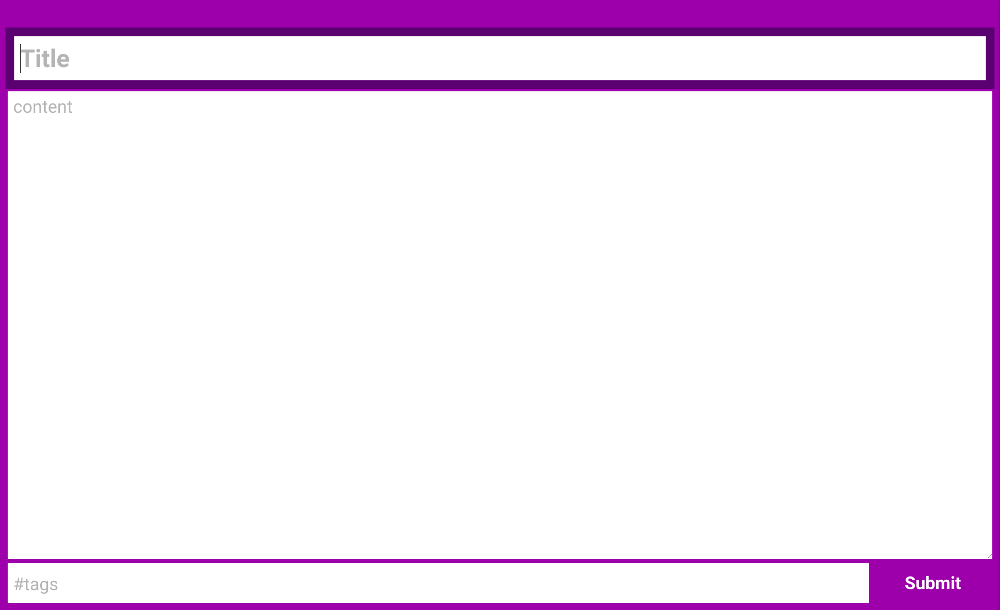
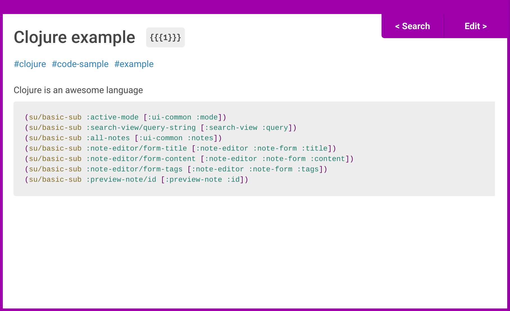

Commands to start dev environment 

```bash
lein less auto
lein with-profile dev figwheel ui-dev
lein cljsbuild auto main-dev
lein re-frisk
# after compile of ui-dev and main-dev, 
electron .
```

`Ctrl+Shift+N` opens the new note view. `Ctrl+Shift+S` opens the search view. Hitting those combos again hides the window saving state. Switching between views also maintains state. Hitting `Esc` will hide the window and kill any current state. 

We have 2 builds, ui and electron main. UI pulls from both the `/cljs/ui` and `/cljs/common` folders. The main class is `electro-note.core`. Main pulls from both the `/cljs/main` and `/cljs/common` folders. The main class is `electro-note.main-proc.core`. 

todo:

 - Create and validate `-min` builds.
 - Package the app.
 - Add pinned notes feature.
 - [+] Add tools to enable note to be inserted into another.
 - [+] Convert the note storage mechanism to use :id internally.
 - [+] Research the incorporation of finite state machines or behavior trees.
 - [+] Trim nicely the preview in search view & render the MD.
 - [+] Save the notes.
 - Add arrow key functionality to search view.
